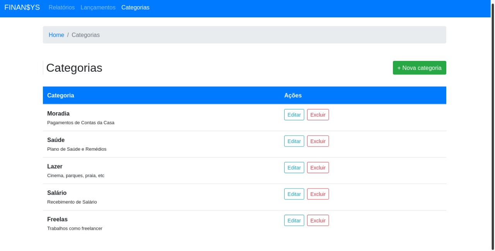
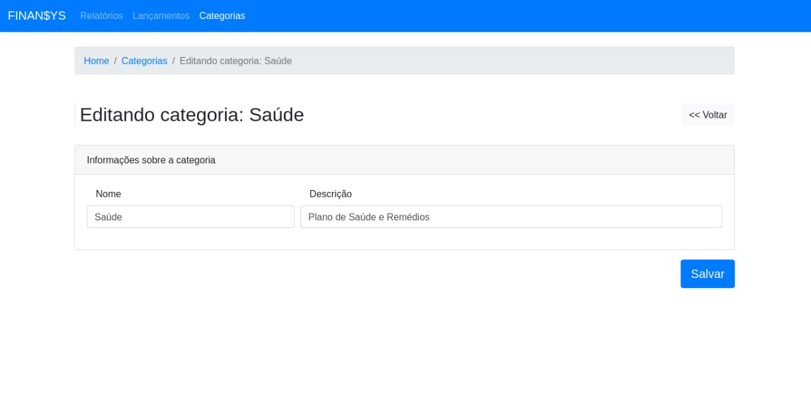

# FINAN$YS

Projeto desenvolvido no curso [Angular Avançado: Master/Detail](https://www.udemy.com/course/angular-avancado/) para
aprimorar as habilidades em Angular.

# Docker

Para subir a aplicação utilizando docker use o comando abaixo:

```shell
docker build -t finansys-web .
docker run --name finansys-web -p 8888:80 finansys-web
```

Ou, utilizando `docker-compose` use o comando:

```shell
docker-compose up --build -d  # Subir a aplicação no modo detached
# ou
docker-compose up --build # Subir aplicação no modo attached
```

## Telas

| Listagem de categoria                                 | Edição de categoria                                     |
|-------------------------------------------------------|---------------------------------------------------------|
|  |  |
